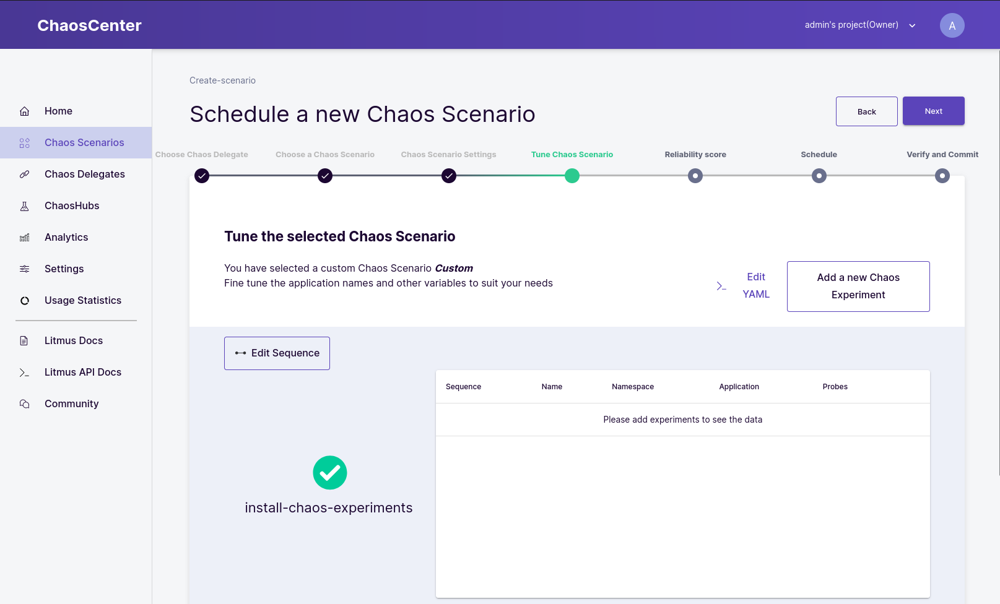

# Chaos Engineering with Litmus

Cloud native technologies allow us to bring supercharged architectures up and running in no time. Resources get smaller and more lightweight. Adding Infrastructure as Code and GitOps concepts we are enabled to rollout more frequent and more distributed than ever before. But are we confident in our systems? Adding a little chaos to the mix will massively improve the confidence in the systems we build.

## Principles of Chaos

Let's talk a bit about this 'little chaos' we can use to boost our confidence in the system. In distributed computing we have a common set of fallacies that we often just take as granted in our world:

* The network is reliable
* There is zero latency
* Bandwidth is infinite
* The network is secure
* Topology never changes
* The network is homogeneous
* Consistent resource usage with no spikes
* All shared resources are available from all places

We can see that most of these fallacies occur because we tend to ignore hazardous chaos interrupting our happy state. A lot of platform operators fear these, but they shouldn't! They should embrace the chaos!

With the principles of chaos engineering, we try to simulate these events and gain confidence by proving that our system can withstand these disruptive situations. Despite being called chaos engineering, the discipline itself is very empricial.

### In practice

Defining a empirical approach to chaotic behaviour can follow these four steps:

1. Define a 'steady state' with measurable output of your system in normal circumstances
2. Create a hypothesis that your system will continue under chaotic behaviour the same as in normal every day business
3. Introduce scenarios that reflect real world events (Application crashes, Memory shortage, ...)
4. Verify your hypothesis by comparing the difference in the steady state and the behaviour in the chaotic world

Resulting from these scenarios you will either gain confidence from the start, or you will detect weaknesses in your system that you will improve.

## Tooling

Before introducing a new tool to our already widely spread armory, I'd like to consider the [CNCF Landscape](https://landscape.cncf.io/). Luckily they already have a section for Chaos Engineering Tools ready:


Because I was already very familiar with Argo I chose Litmus going forward. Under the hood Litmus builds upon Argo to run scenarios as Workflows.

### Installation Litmus on OpenShift

The installation of the Litmus Chaos Center ist documented [here](https://docs.litmuschaos.io/docs/user-guides/chaoscenter-namespace-scope-installation/). In the following I will show you how I installed Litmus via Helm Chart on OpenShift 4.10 in a namespaced manner.

Create the namespace you want your Litmus installation to be located:

```shell
oc new-project 


To override certain elements which differ in the Helm chart for the OpenShift flavor create the following file:

```shell
cat <<EOF > override-openshift.yaml
portalScope: namespace
portal:
  server:
    authServer:
      securityContext: null
    graphqlServer:
      securityContext: null
    service:
      type: ClusterIP
  frontend:
    securityContext: null
    service:
      type: ClusterIP
openshift:
  route:
    enabled: true

mongodb:
  containerSecurityContext:
    enabled: false
  podSecurityContext:
    enabled: false
EOF
```

Finally install the Helm release:

```shell
helm install chaos litmuschaos/litmus --namespace=litmus -f override-openshift.yaml
```

Helm should confirm your installation like the following:

```text
NAME: chaos
LAST DEPLOYED: Wed Sep 28 10:53:05 2022
NAMESPACE: litmus
STATUS: deployed
REVISION: 1
TEST SUITE: None
NOTES:
Thank you for installing litmus 😀

Your release is named chaos and it's installed to namespace: litmus.

Visit https://docs.litmuschaos.io to find more info.
```

Wait for your pods to get ready, and as soon as all pods reach their readiness, check out your new chaos control hub!

```shell
oc get route chaos-litmus-route -ogo-template='{{ .spec.host }}'
```

Log into the control hub with the credentials:

```
Username: admin
Password: litmus
``` 


Verify in the Menu under `Chaos Delegates` that there is one delegate in the scope `Namespace` called `Self-Agent` with status `Active`. When your self-agent Chaos Delegate is all set and ready, it's time to create your first Chaos Scenario!


### Your very first scenario

To generate chaos, we first have to create a ready state! Let's create some simple deployments we can use as a steady-state:

```yaml
apiVersion: apps/v1
kind: Deployment
metadata:
  labels:
    app: example-web-go
  name: example-web-go
spec:
  replicas: 4
  selector:
    matchLabels:
      app: example-web-go
  template:
    metadata:
      labels:
        app: example-web-go
    spec:
      containers:
      - image: quay.io/acend/example-web-go:latest
        name: example-web-go
        resources:
          requests:
            cpu: 10m
            memory: 16Mi
          limits:
            cpu: 20m
            memory: 32Mi
```

And a service to verify their health:

```yaml
apiVersion: v1
kind: Service
metadata:
  name: example
  namespace: litmus
spec:
  ports:
  - port: 5000
    protocol: TCP
    targetPort: 5000
  selector:
    app: example-web-go
  sessionAffinity: None
  type: ClusterIP
```

Head over to the `Chaos Scenarios` menu item and click `Scedule a new Scenario`, choose your Self-Agent as the agent and select that you would like to "Create a new Chaos Scenario using the experiments from **ChaosHub**" and select the default **Litmus ChaosHub**. Give your first scenario a name and description and head to the next page. This was all pretty default stuff. From now on it will get more interesting, I promise!

In the next screen we can create the Argo Workflow which will represent our Chaos Scenario:



Add a new Chaos Experiment and select from the tempate list "generic/pod-delete". With the edit button you can edit your Chaos Experiment. Let's update it first to delete the pods we just created with the selector `app=example-web-go`:


After defining the selector you will have to define a probe, which will verify the state of the applicaiton. In this case we will simply define a probe which sends a HTTP GET request to `http://example:5000/` and expects the return code to be equal `200`:


When you have added the probe, finish the experiment and the creation of your scenario. You can choose to schedule your Chaos Scenario right now!

Head over to the main page and you will see (hopefully) that your first scenario was a success!
